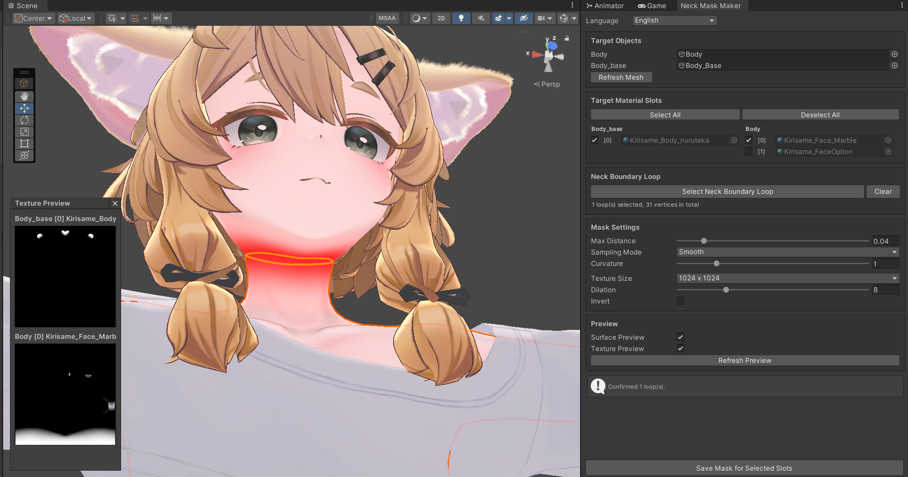

# Neck Mask Maker

VRChat Avatar 颈部遮罩生成工具。GPU 表面采样，逐材质槽独立烘焙与 PNG 导出。

## 安装

1. 打开 [VPM Listing](https://marble810.github.io/vpmlist/) 并添加到 VCC。
2. 打开自己的项目，点击 `Manage Project`，安装 `Neck Mask Maker`。

## 使用

1. 打开 `Tools/Marble/Neck Mask Maker`，指定 `Body` 与 `Body_base`。
2. 在 Scene 中点击颈部边选取循环线，`Shift` 追加，`Enter` 确认，`Esc` 取消。
3. 勾选目标材质槽，调整 Max Distance、采样模式、Texture Size、Dilation 等参数。
4. 开启表面预览 / 贴图预览确认结果。
5. 点击 `Save Mask for Selected Slots`，每个材质槽导出一张 PNG。

需要 Unity 2022.3.22f1、VRChat Avatars SDK 3.10.2 或更新版本，以及支持 Compute Shader 的 GPU。界面支持 中文 / 日本語 / English，不会修改原 Avatar 或场景。避免 VPM、`.unitypackage` 与开发链接重复安装。

更新见 [CHANGELOG](CHANGELOG.md)。
